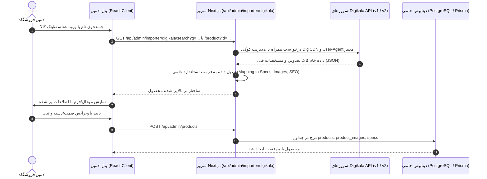

# SPEC-022: وارد کردن هوشمند محصول از دیجی‌کالا در پنل ادمین (Digikala Product Importer)

- **وضعیت:** پیش‌نویس مشخصات (Phase 1: Specify)
- **تاریخ:** ۲۰۲۶-۱۰-۱۰
- **نویسنده:** Antigravity / Pair Programming
- **دامنه:** پنل مدیریت حامی (`/admin/products` و `/admin/products/import-digikala`)

---

## ۱. فرضیات اولیه (Assumptions)

> [!IMPORTANT]
> **فرضیاتی که بر اساس معماری فعلی پروژه در نظر گرفته شده‌اند:**
> 1. این قابلیت صرفاً برای مدیران (`Role.ADMIN` و `ADMIN_SUPER`) و در پنل مدیریت فعال خواهد بود و نیازمند دسترسی احراز هویت شده ادمین است.
> 2. درخواست‌ها به دیجی‌کالا باید مستقیماً از **سمت سرور (Next.js Route Handlers)** ارسال شوند (Server-side Proxy / Fetcher) تا مشکلات CORS مرورگر برطرف گردد.
> 3. سیستم محافظتی DigiCDN برای اندپوینت‌های دیجی‌کالا از ریدایرکت ۳۰۷ با کوکی موقت `digicdn_cookie` استفاده می‌کند؛ هندلر سرور ما به‌طور خودکار این هندشیک و کوکی را دریافت و مدیریت می‌کند (بدون نیاز به پکیج‌های حجیم شخص ثالث).
> 4. داده‌های استخراج شده شامل:
>    - عنوان فارسی و انگلیسی
>    - اسلاگ (Slug) پیشنهادی
>    - توضیحات و نقد و بررسی (Content / Description)
>    - ویژگی‌ها و مشخصات فنی (`specs: [{ name, value }]`) منطبق بر ساختار استاندارد دیتابیس پروژه ما
>    - تصاویر اصلی محصول (با قابلیت انتخاب تصویر شاخص و گالری)
>    - برند (تطبیق خودکار با برندهای موجود در دیتابیس یا پیشنهاد ایجاد برند جدید)
>    - سئو (عنوان و توضیحات متای استخراج شده)
> 5. مدیر پیش از ثبت نهایی در دیتابیس، امکان پیش‌نمایش، ویرایش قیمت، دسته‌بندی و ویژگی‌ها را دارد تا محصول مستقیماً با فرم استاندارد ثبت محصول منطبق شود.

---

## ۲. اهداف و چشم‌انداز (Objective)

- **مسئله:** افزودن دستی محصولات فروشگاه (تایپ مشخصات، دانلود و آپلود تصاویر، نگارش متون سئو و ترجمه عناوین) فرآیندی زمان‌بر و خسته‌کننده برای ادمین است.
- **راهکار:** ایجاد یک موتور واردکننده کالا با دو حالت ورودی:
  1. **جستجوی کلیدواژه (Search by Keyword):** ادمین نام کالا را سرچ کرده، لیست نتایج دیجی‌کالا را با تصویر و قیمت مشاهده می‌کند و با یک کلیک کالای مورد نظر را انتخاب می‌نماید.
  2. **ورود مستقیم با شناسه/لینک (Import by URL / DKP ID):** ادمین لینک محصول دیجی‌کالا (مثلاً `https://www.digikala.com/product/dkp-12345/`) یا شناسه آن را درج کرده و مستقیماً اطلاعات کالا لود می‌شود.
- **نتیجه موفقیت‌آمیز:** ادمین در کمتر از ۵ ثانیه می‌تواند تمامی مشخصات فنی، متون و تصاویر یک گوشی یا کالای دیجیتال را لود کرده، دسته‌بندی فروشگاه را مشخص نموده و با قیمت دلخواه در فروشگاه ذخیره کند.

---

## ۳. معماری فنی و جریان داده (Technical Architecture)



---

## ۴. قراردادهای API (API Contracts)

### ۴.۱. جستجوی محصولات در دیجی‌کالا
- **مسیر:** `GET /api/admin/importer/digikala/search`
- **مجوز:** دسترسی ادمین
- **پارامترها:**
  - `q` (string, الزامی): عبارت جستجو
  - `page` (number, اختیاری، پیش‌فرض ۱)
- **پاسخ موفق (200 OK):**
```json
{
  "products": [
    {
      "id": 16603814,
      "titleFa": "کاور هپرو مدل MC مناسب برای گوشی سامسونگ A30",
      "titleEn": "",
      "imageUrl": "https://dkstatics-public.digikala.com/digikala-products/...",
      "price": 145000,
      "rate": 4.2
    }
  ],
  "pager": {
    "currentPage": 1,
    "totalPages": 5
  }
}
```

### ۴.۲. دریافت جزئیات کامل و تبدیل‌شده محصول
- **مسیر:** `GET /api/admin/importer/digikala/product`
- **مجوز:** دسترسی ادمین
- **پارامترها:**
  - `id` (number یا string الزامی): شناسه محصول (یا استخراج شده از لینک dkp)
- **پاسخ موفق (200 OK):**
```json
{
  "name": "گوشی موبایل سامسونگ مدل Galaxy A55",
  "englishName": "Samsung Galaxy A55 5G Dual SIM 256GB",
  "suggestedSlug": "samsung-galaxy-a55-5g-256gb",
  "description": "نقد و بررسی کامل کالا...",
  "descriptionText": "متن ساده توضیحات...",
  "brandName": "سامسونگ",
  "brandEnglishName": "Samsung",
  "suggestedPrice": 21500000,
  "images": [
    {
      "url": "https://dkstatics-public.digikala.com/digikala-products/...",
      "altText": "گوشی سامسونگ A55",
      "isDefault": true
    }
  ],
  "specs": [
    { "name": "حافظه داخلی", "value": "۲۵۶ گیگابایت" },
    { "name": "مقدار رم", "value": "۸ گیگابایت" },
    { "name": "شبکه‌های ارتباطی", "value": "5G, 4G, 3G" }
  ],
  "seoTitle": "خرید گوشی سامسونگ A55 با بهترین قیمت",
  "seoDescription": "مشخصات فنی و قیمت گوشی سامسونگ گلکسی A55..."
}
```

---

## ۵. تغییرات رابط کاربری در پنل ادمین (UI / UX)

1. **دکمه ورودی در لیست محصولات (`/admin/products`):**
   - افزودن دکمه جذاب **«وارد کردن از دیجی‌کالا»** (با آیکون دانلود/ابر و استایل لوکس سازگار با تم حامی) در کنار دکمه «محصول جدید».
2. **دیالوگ/صفحه ایمپورت (`DigikalaImportDialog` یا صفحه اختصاصی):**
   - تب ۱: **جستجو در دیجی‌کالا** (همراه با اینپوت جستجو، فیلتر و کارت‌های نتایج با عکس بندانگشتی، عنوان و قیمت).
   - تب ۲: **ورود مستقیم با لینک یا کد کالا** (شناسایی خودکار شناسه از لینک‌های کپی شده از دیجی‌کالا).
3. **مرحله انتقال به فرم محصول:**
   - پس از انتخاب محصول، مدیر می‌تواند انتخاب کند:
     - مستقیماً به فرم ویرایش استاندارد محصول منتقل شود و تمام فیلدها (عکس‌ها، اسلاگ، ویژگی‌ها، متون) از قبل پر باشند.
     - یا ثبت سریع (Quick Save) همراه با انتخاب دسته‌بندی و قیمت.

---

## ۶. برنامه‌ریزی آزمون و معیارهای پذیرش (Acceptance Criteria)

- [ ] تست واحد برای ماژول استخراج لینک دیجی‌کالا (`extractDigikalaId` با فرمت‌های مختلف dkp و url).
- [ ] تست هندلر سرور برای دور زدن ریدایرکت ۳۰۷ DigiCDN و مدیریت کوکی امن.
- [ ] تبدیل ساختار `specifications` دیجی‌کالا به آرایه `specs: [{ name, value }]` دیتابیس حامی.
- [ ] ایمپورت تصاویر بدون خطای Mixed Content و ذخیره مستقیم URL معتبر تصاویر.
- [ ] حفظ عدم دسترسی برای کاربران غیر ادمین (بررسی وضعیت ۴۰۳ / ۴۰۱).
- [ ] اجرای موفق `npm run typecheck` و تست‌های پروژه.

